# 📘 Curso de Git

## Introducción

Este trabajo práctico individual surge de los apuntes que tomé en un curso de Git, específicamente enfocado en las herramientas y flujos de trabajo relevantes para mi postulación a la Sociedad Científica de Estudiantes de Sistemas e Informática (SCESI).

Durante el curso, cubrimos desde los principios básicos del control de versiones hasta la gestión de ramas y la colaboración remota.

## Clase 1️⃣

  ### ¿Ques es git?
  Git es un sistema de control de versiones distribuido.

  En otras palabras cada cambio que se hace git lo guarda como un CheckPoint si pasa algo malo puedes retroceder .

  En conclusion tus errores no son permanentes siempre y cuando hagas commits.

  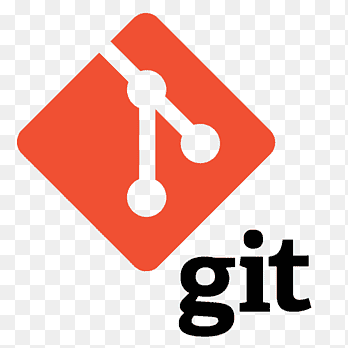

  ### Historia de Git

  Linus Torvalds conocido por sus proyectos como Linux y Git creados casi como una consecuencia no deseada por su deseo de no tener que trabajar con demasiada gente.

  

  Antes de Git el kernel de Linux dependía de una herramienta llamada BitKeeper.
  
  

  Aunque era eficiente era software privado pero Bitkeeper fue ofrecido gratis solo para el proyecto linux una exepcion incluso podia decirse un pacto de caballeros.
  
  En 2005,BitMover la empresa detrás de BitKeeper cortó el acceso gratuito por acusaciones de ingeniería inversa y malentendidos y ego.

  A causa de eso el desarrollo de linux se queso sin una herramienta para gestionar la colosal cantidad de lineas de codigo que tenia.

  Sin embargo Linus Torvalds no se quedaria con los brazos cruazados y a raiz de eso se encerro aproximadamente 2 semanas y creo su propia herramienta de control de versiones.

  Pero hay que saber que Linus no creó Git para el mundo sino porque ya no confiaba en nadie ni en licencias externas quería algo que nadie pudiera quitarle.

  En conclusion las mejores herramientas a veces no nacen de la calma sino del conflicto y la rabia convirtiéndose en el lenguaje universal de la programación.

  ### Instalacion de Git

  Dependiendo en el sitema operativo que te encuentres Git se instala de diferentes formas: 

     En windows es descargando el archivo .exe desde la pagina de Git

   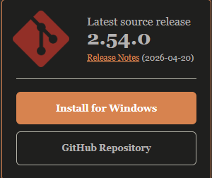

     En Linux la situacion es diferente ya dependiendo en que distribucion estes el comando puede variar pero eso esta en su pagina.

     ejemplo:
      debian y derivados

         -sudo apt install git

      Arch y derivados

         -sudo pacman -S git

  Y finalmente para ver si la intalacion fue correcta verificamos con el comando:

      - git --version        

  Como dato hay que decir que hay 2 archivos necesarios que deben existir en todos los repositorios.

  

  ### Configuraciones Basicas

  Para poder empezar a utilizar lo correcto es poner datos a Git el nombre y un Email pero tomando en cuenta que el Email tiene que ser el mismo que se usara para la posterior creacion de una cuenta en Github.

  Los comandos son:

    Para el nombre

      -git config --global user.name "Tu Nombre"

       nombre completo    

    Para el Email

      -git config --global user.email "tu_correo@ejemplo.com"

   Finalmente comprobamos si los datos son correctos con:

    -git config --list   

## Clase 2️⃣

   ### States y Commits

   ###   Los estados de Git

   se dividen en 3: 
      
       -Un directorio modificado 
       que git aun  no lo tiene registrado

       - Stage o el area de espera estas diciendo
       a git que es lo que quieres guardar

       -Confirmar todos los cambias y estos se les genera una ID

    

  vamos explicando cada punto:

  -Git observa tus archivos y los clasifica en dos estados principales:

    Untracked: archivos nuevos que Git detecta pero aún no están siendo seguidos.
    Modified: archivos que ya estaban en Git y fueron modificados, eliminados o renombrados.
 
  Los archivos que no están en .gitignore siempre entran en uno de estos estados según los cambios que hagas.

  Pero que pasa si yo quiero volver a un estado o version anterior, por decir hice un cambio que no funciono o borre algo importante

  se usa el comando: 

     git restore <archivo> 

  Pero hay que tener cuidado al usarlo por que borra todos los cambios no guardados.
 
 Pero tambien puede pasar que tu creas un archivo que tu quieres que git no lo vea 

 simplemento lo guardas en el archivo gitignore.

   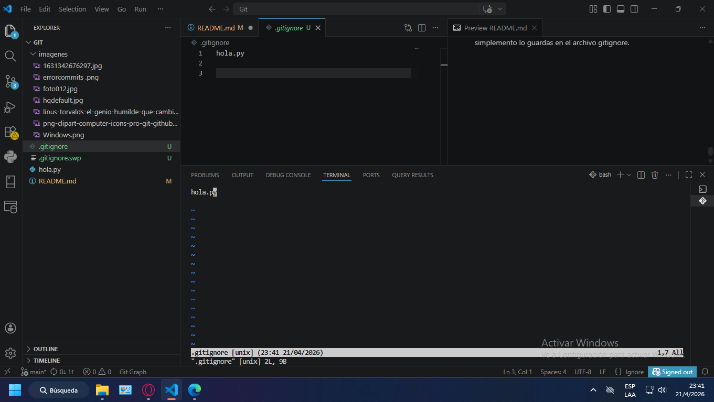

-Lo siguien es el stage donde se seleccionan los archivos que seran parte del siguiente commit 

los comandos para esto son:

    git add Archivo.txt

    o 
   
    git add .

 donde el primero solo añade un archivo especifico y el otro añade todos los cambios.

 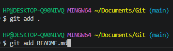

-Y finalmente se hace el commit que guarda todos los cambios que propusiste en el stage 
el comando es:

    git commit -m "detalles del commit"

Pero puede pasar que hiciste un commit equivocado para eliminar el commit es:

    git reset --soft HEAD~1

   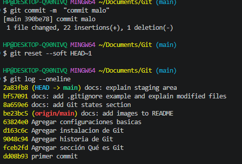

hay que recalcar que esta se va eliminando segun el orden, eliminara el ultimo commit que hiciste y para eliminar mas cambia el 1 por 2 o 3 pero eso no deberia pasar.    
 
  ### Buenas Practicas

  Commits atómicos y buenas prácticas

Los commits atómicos consisten en que cada commit represente un cambio pequeño, lógico y completo.

Es mejor hacer varios commits pequeños con sentido que uno grande con muchos cambios.

Usa verbos imperativos:

    Add → agregar

    Change → modificar

    Fix → corregir

    Remove → eliminar
    
    No uses punto final ni “…”

    Máximo 50 caracteres (ser claro y conciso)

Usar prefijos para identificar que tipo de cambios se hiso:

     docs: explain staging area with examples

 los prefijos mas comunes son : 

     feat: nueva funcionalidad

    fix: corrección de errores

    docs: documentación

    refactor: mejora interna del código

    style: formato (espacios, tabs, etc.)

    test: pruebas
 
 Pero existen casos donde los 50 caracteres no son suficientes para heso hacer un commit mas extenso el comando es:

      git commit

Y se abrira un editor de texto normalmente Vim hay en la primera fila es el nombre del commit y la segunda la explicacion del commit.

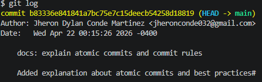

## Clase 3️⃣

 ### GIT HUB Y SSH

   ### ¿Que es GitHub?

   Se podria decir que es la nube de git y tambien una red social, donde se pueden subir proyectos personales y tambien poder trabajar en equipo esos proyecots.

   a veces los confunden pensando que es lo mismo pero nada mas alejado dela realidad ya que git es donde se guardan los cambios y github donde se almacenan.

   

  ### SSH vs HTTPS

  ### SSH

   
    Es una forma segura de conectarte a GitHub sin usar usuario ni contraseña cada vez

    Creas una clave en tu computadora
    Le das una copia a GitHub
    Cuando te conectas, se reconocen automáticamente

  

  ### HTTPS

    Es una forma de conectarte a GitHub usando usuario + token

    GitHub te pide:
     -usuario
          -token (como una contraseña especial)
          -Puede guardarse en tu PC
     -Luego ya no te lo vuelve a pedir

  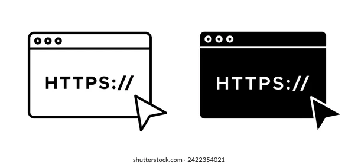

  ### Configuracion SSH 

   En esta parte me ayude de una pagina que explica como generar las claves SSH ya que no logre entender muy bien durante la clase 

   [Generación de una nueva clave SSH y adición al agente SSH](https://docs.github.com/es/authentication/connecting-to-github-with-ssh/generating-a-new-ssh-key-and-adding-it-to-the-ssh-agent)   

   obviamente no lo segui al pie de la letra pero trate de hacer lo mas cercano ala clase 

   Ayudandome de la clase, la pagina y la IA pude hacer la configuracion con los siguientes pasos:

      1._ Crear clave SSH 

         ssh-keygen -t ed25519 -C  "jheronconde032@gmail.com"

         Con esto una clave pública y privada para identificar la computadora con GitHub

  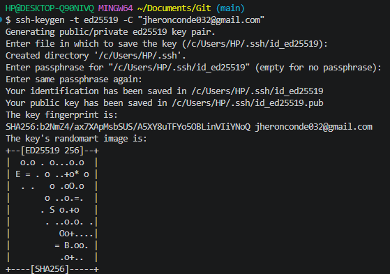

      2._  Iniciar el agente SSH

        eval "$(ssh-agent -s)"

        Activa un proceso que gestiona tus claves SSH en segundo plano

      3._   Añadir la clave al agente

        ssh-add ~/.ssh/id_ed25519

        Registra tu clave para que pueda usarse automáticamente sin pedirla cada vez

      4._ Copiar la clave pública

         cat ~/.ssh/id_ed25519.pub

       Muestra tu clave pública para copiarla y registrarla en GitHub

  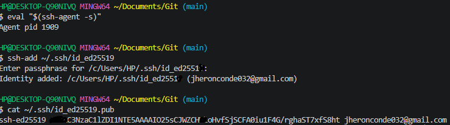

      5._Agregar la clave en GitHub

       creamos una nueva llave SSH y colocamos la clave publica hay

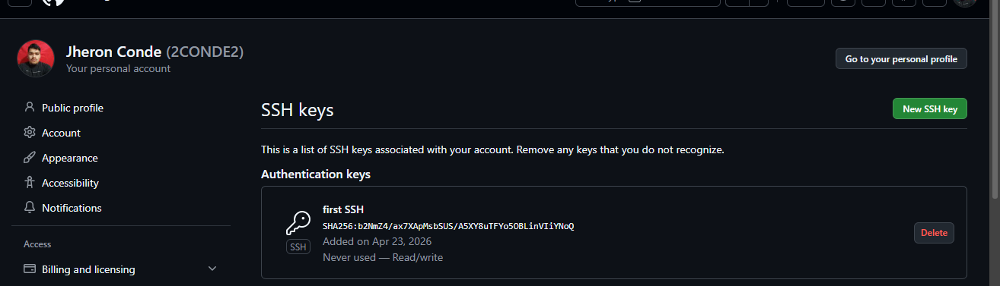

      6._ Verificamos si se conecto

        ssh -T git@github.com

   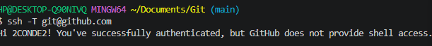     

      7._ Usar SSH en el repositorio y verificamos si funciono
 
           git remote set-url origin git@github.com:2CONDE2/Apuntes_Git_2026

           git remote -v
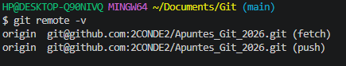
  ### Crear un repositorio en github

  bueno me acavo de dar cuenta que lo vingule al repositorio sin antes mostrar como se crea 

  pero no es complicado simplemente es ir a tu perfil de github e ir ala seccion new repository. 

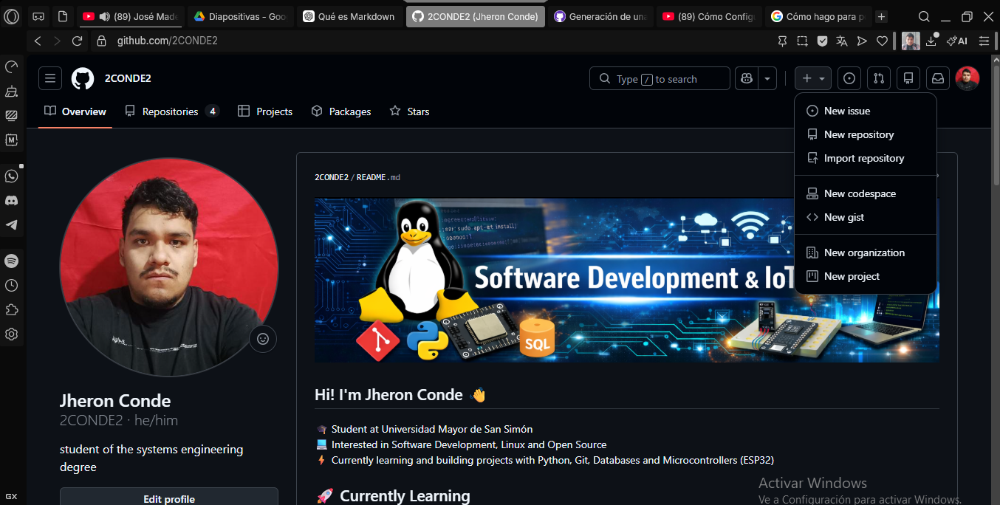

  para conectarlo se usan los siguientes comandos 

           git remote add origin git@github.com:2CONDE2/Apuntes_Git_2026

          git branch -M main

          este cambia el nombre de la rama en mi caso no fue necesario por que ya se llamaba main pero hay el caso que se llama master lo recomendable es que se llame main.

          git push -u origin main

          y con esto ya puedes subir los cambios a github esto normalmente para la primera vez 
           ya despues puedes usar simplemente 
           git push 

  ### clonar un repositorio en Git

   hay dos maneras dependiendo de la llave que tengas como yo estoy usando ssh seria con el siguiente comando 

     git clone git@github.com:2CONDE2/Apuntes_Git_2026

       
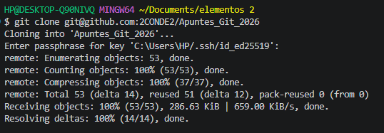
  con eso queda claro lo de subir archivos pero que pasa si alguien hiso aportes a mi repositorio y acepte los cambios como actualizo mi repositorio local?

 

        git pull origin <rama>

  git pull actualiza tu proyecto con los últimos cambios del repositorio remoto

## Clase  4️⃣  

antes de empezar con los apuntes debo decir que el dia de hoy 24/4/2026 por cuestiones de tiempo no pude cumplir con el commit dentro del tiempo estimad pero ya hable con el encargado del area explicando mi situacion y me dijo que no habia problema gracias por la comprension.
  
       

   